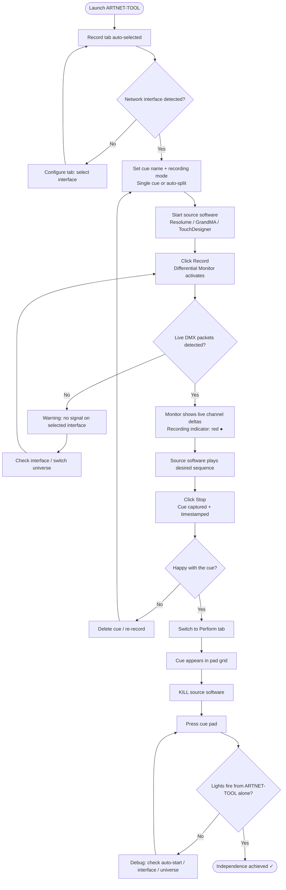
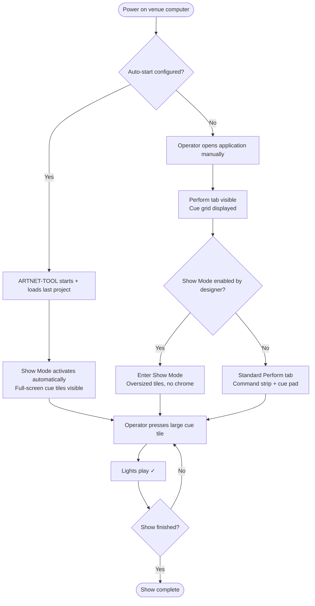
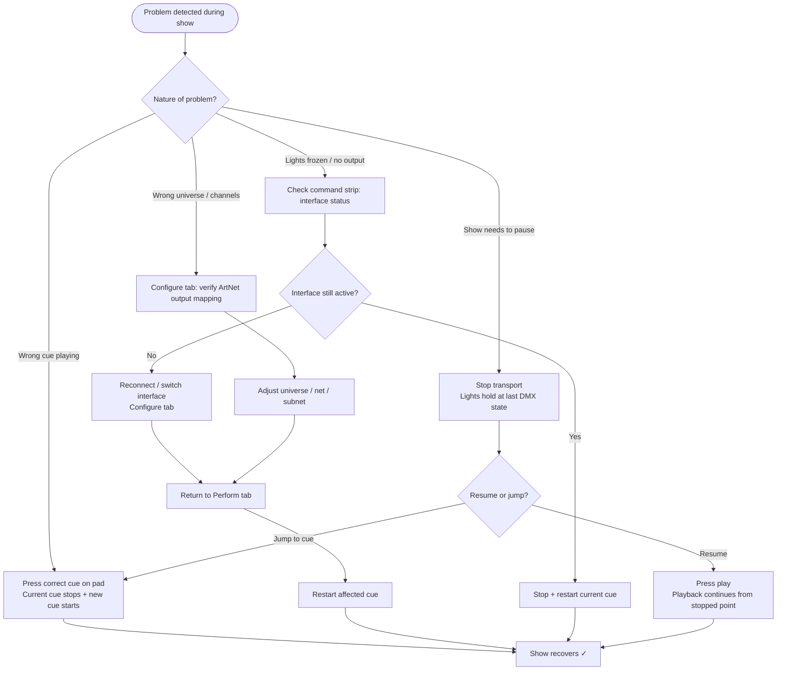
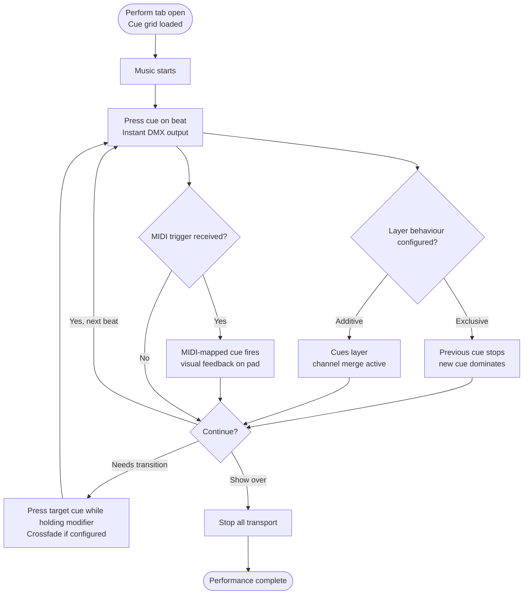

# UX Design Specification ARTNET-TOOL

**Author:** NODATA
**Date:** 2026-03-06

---

## Executive Summary

### Project Vision

ARTNET-TOOL is a standalone cross-platform desktop application that passively captures ArtNet/sACN DMX traffic from any source software and plays it back completely independently — no source license required on the deployment machine. It occupies an uncontested market position as a **player**: not a creator, not a controller, but the bridge that liberates recorded DMX data from its originating software and makes it autonomous, portable, and deployable anywhere.

The product's core promise is visceral and self-demonstrating: record your show, kill the source software — the lights still play. That independence is the UX's north star. Every interaction, every screen, every flow must serve either the act of capturing that independence or deploying it reliably.

### Target Users

| Persona | Who They Are | UX Priority |
|---|---|---|
| **Creative Technologist / Light Designer** (Primary) | Freelance LD deploying installations — technically fluent, not a developer | Efficient record-configure-export workflow; confidence that capture is working |
| **VJ / Live Performance Artist** (Primary) | VJ using Resolume; needs DMX as a dedicated, isolated layer | Fast scene triggering, live speed control, MIDI-first interaction |
| **House Technician / Venue Operator** (Secondary) | Non-technical venue staff running the space daily | Zero-training cue pad — must work from a sticky-note instruction alone |
| **Client / Venue Owner** (Secondary) | Buyer who needs it to run indefinitely unattended | Irrelevant to UX — they never interact with the application |

### Key Design Challenges

1. **Dual-audience UX tension** — The designer needs a power-user workspace (multi-universe signal monitoring, MIDI mapping, scheduling config); the venue operator needs an interface simple enough to follow off a sticky note. These are the same application, serving radically different mental models and usage contexts.

2. **Mode-shifting interface** — The app has three distinct operational states: **Recording** (watching and capturing incoming ArtNet traffic), **Playback/Performance** (triggering scenes and monitoring output), and **Configuration** (MIDI mapping, schedule setup, boot behavior, project settings). The UX must make these modes immediately clear without requiring a manual.

3. **Non-technical operator zero-training requirement** — The cue pad must communicate scene names, currently-playing state, and trigger affordances clearly enough that a bar manager follows a sticky note and gets it right on the first try. This is a demanding standard for an application that also serves power users.

4. **Unattended headless future** — Linux ARM headless deployment (V4) means layout and primary controls must be architected with a context in mind where the UI exists on a remote or absent screen. Not an MVP constraint, but informs component-level decisions today.

### Design Opportunities

1. **The "It's Working" moment** — The Differential Monitor is the proof-of-life screen. Making it immediately readable and satisfying to watch — channels illuminating as capture happens — is a high-value trust-building moment that confirms the tool is doing what it promises before a single scene is saved.

2. **The Cue Pad as performance surface** — The scene library isn't just a list — it's the operator's daily interface and the VJ's live trigger pad. Designing it as a performance-grade surface (clear labels, large hit targets, current-state feedback) serves both the venue operator and the live performer in a single design decision.

3. **The project file as handoff ceremony** — Export/import is not a generic save-and-load; it's the moment a designer hands a complete show to a venue. A confident, clear handoff flow (what's included, how to open it, one-page setup confirmation) transforms a technical operation into a professional delivery artifact.

---

## Core User Experience

### Defining Experience

The defining interaction of ARTNET-TOOL is the **scene trigger** — the moment a recorded DMX state or animation is fired, whether by keyboard, MIDI, schedule, or manual click. Every interface decision radiates outward from making this interaction instantaneous, legible, and reliable.

The product's core promise is demonstrated in a single sequence: record a show, close the source software, press play — the lights still work. The UX must make each step of this sequence feel confident and complete, with clear confirmation at every transition that capture succeeded, playback is independent, and the show is ready to deploy.

### Platform Strategy

**Primary platform:** Cross-platform native desktop application — Windows (primary), macOS (required), Linux ARM (V4)
**Interaction model:** Mouse + keyboard primary; MIDI controller integration is a first-class, not secondary, interaction path
**Offline-first:** No internet dependency at any point; designed to run on air-gapped venue machines
**Future web surface:** V2 web remote (local-network, any browser) for smartphone-based scene triggering — the UI layout must accommodate this without requiring a redesign of core components
**Headless future:** V4 Linux ARM deployment without display — layout and state architecture should not assume a screen is always present for the playback path

### Effortless Interactions

The following interactions must require zero cognitive load — the user should not have to think, search, or learn:

- **Is capture working?** — The Differential Monitor answers this immediately through visual signal differentiation; no parsing required
- **Which scene is playing?** — The active scene is always unambiguously highlighted on the cue pad; no status bar lookup required
- **Switch scene** — One keypress or one MIDI note; no menus, no confirmation dialogs
- **Will this run when I leave?** — Auto-start and boot configuration status is visible on the main interface, not buried in settings; "ready to deploy" state is confirmable at a glance

### Critical Success Moments

1. **The independence moment** — The designer closes their source software and presses play. The lights work. This is the product's proof of value and must be the most satisfying, confidence-building moment in the entire UX.
2. **Zero-training cue pad** — A venue operator with a sticky note presses the right labeled key and the lights change. No errors, no wrong state, no confusion. If this fails, the deployment fails.
3. **Silent boot recovery** — The machine reboots after a power failure. ARTNET-TOOL starts, loads the project, begins playback. The designer never gets called.
4. **Complete handoff** — A designer exports a project file and sends it. The recipient installs ARTNET-TOOL, opens the file — scenes, schedules, MIDI mappings, and boot config are all there. Nothing is missing. The handoff is a file.

### Experience Principles

1. **Signal over noise** — The interface communicates what's happening (signal flowing, scene active, capture live) without requiring interpretation. State is always visible and always legible.
2. **The scene is the unit** — All primary interactions revolve around scenes. The cue pad is the cockpit. Everything else — scheduling, MIDI mapping, boot config — is configuration that enables the cue pad to perform.
3. **Modes are explicit, not hidden** — Recording, Playback, and Configuration are distinct states entered deliberately. The current mode is always unambiguous; accidental mode switching is not possible.
4. **Reliability is visible** — Auto-start status, crash recovery configuration, and boot behavior are first-class UI concerns — not buried in settings. The user must be able to confirm "this will run when I leave" without navigating a preferences panel.

---

## Desired Emotional Response

### Primary Emotional Goals

**For the Creative Technologist / Designer:**
**Confidence and relief** — The primary emotional arc ends with the designer walking away from a deployment knowing it will run without them. The UX must build toward this feeling step by step: confidence that capture is working, confidence that playback is independent, confidence that the system will boot and recover without intervention. The final deployment moment should feel like completing a handoff, not abandoning a fragile setup.

**For the VJ / Live Performer:**
**Control and immediacy** — The VJ needs to feel the system responds to them, not the other way around. Scene triggers must feel instant and tactile. Speed control in the moment must feel like reaching for a fader, not navigating a menu. The emotional target is the feeling of an instrument, not a tool.

**For the Venue Operator:**
**Calm competence** — The non-technical operator should never feel confused, lost, or anxious. The interface must convey that there are only a few things to do and they are all obvious. Success looks like a venue operator who feels capable — not because they learned software, but because the software asked nothing of them.

### Emotional Journey Mapping

| Stage | Designer | Venue Operator | VJ |
|---|---|---|---|
| **First open** | Curious, slightly skeptical — "will this actually work?" | Potentially intimidated — "I hope I don't break it" | Evaluating — "is this fast enough?" |
| **During capture** | Attentive, building confidence — watching the monitor for proof it's working | N/A | N/A |
| **The independence moment** | Surprised relief turning to conviction — "it actually works without the source" | N/A | N/A |
| **Deploying / handing off** | Pride and professionalism — delivering a complete, self-contained show | N/A | N/A |
| **Returning daily (operator)** | N/A | Calm, habitual — a routine that works | N/A |
| **Live performance (VJ)** | N/A | N/A | Flow state — not thinking about the tool |
| **Something goes wrong** | Concern turning to relief — auto-recovery or clear diagnosis path | Slight anxiety, then relief when reboot fixes it | Brief frustration, quickly resolved |

### Micro-Emotions

**Build toward confidence, avoid confusion:**
- **Trust** (not skepticism) — the Differential Monitor must immediately show that signal is being captured; proof before the user has to ask
- **Accomplishment** (not frustration) — completing the record-deploy loop must feel like finishing a task, not fighting a system
- **Calm** (not anxiety) — the venue operator's primary emotional protection; the interface must never present more choices than necessary
- **Flow** (not friction) — the VJ must enter a mental state where they're performing, not operating software

**Emotions to actively design against:**
- **Uncertainty** — "is it working?" should never be a question without an immediate, visible answer
- **Anxiety about breakage** — the venue operator must feel they cannot accidentally do something unrecoverable
- **Distraction** — the VJ's live interface must not pull focus; it exists to serve the performance, not demand attention

### Design Implications

| Emotion Target | UX Design Approach |
|---|---|
| **Confidence (designer)** | Differential Monitor as prominent, always-visible proof of signal; explicit "capture confirmed" state when a recording stops; clear active/inactive indicators on every operational element |
| **Relief at handoff** | Export flow that summarizes exactly what's included in the project file — scenes, mappings, schedule, boot config — as a checklist; a "ready to deploy" confirmation state |
| **Calm (venue operator)** | Cue pad as the primary — and ideally only — surface they ever need; scene names as plain language labels; large hit targets; currently-playing state that cannot be missed |
| **Flow (VJ)** | Keyboard and MIDI triggers as first-class, requiring zero mouse interaction; speed control accessible without leaving the cue pad view; no confirmation dialogs on trigger |
| **Trust** | System status (recording active, playback running, auto-start configured) always in peripheral view; no silent failures; every error is plain language with a next step |
| **Accomplishment** | The independence moment (playback after source killed) should be visually satisfying — not just functional; the active playback state should feel alive, not inert |

### Emotional Design Principles

1. **Prove it before the user asks** — Don't wait for the user to wonder if something is working. The interface surfaces proof of operation proactively: signal moving in the monitor, scene actively playing, auto-start armed. Confidence is built through visible evidence, not faith.

2. **Protect the non-technical user from complexity** — The venue operator's emotional safety depends on never encountering a decision they don't understand. Power-user controls must not intrude on the cue pad surface. Configuration lives elsewhere; performance lives here.

3. **Make the independence moment feel earned** — The first time playback works without the source software, that moment deserves to land. The visual state of "playing independently" should be unambiguous and satisfying — the lights are on, the system is alive, the designer's work is done.

4. **Error is a conversation, not a failure** — When something goes wrong, the emotional response should be "I know what happened and what to do next" — not confusion or dread. Every error is plain language. Every error has a direction.

---

## UX Pattern Analysis & Inspiration

### Inspiring Products Analysis

**Ableton Live — Session View**
The clip-launching grid is the gold standard for performable cue pads. Each clip cell shows name, state (stopped/playing/queued), and color-coded identity at a glance. Triggering is instantaneous — no confirmation, no navigation. The session view vs. arrangement view distinction is a direct analog to ARTNET-TOOL's Performance vs. Configuration mode split. Key lesson: the performance surface is sacred; configuration belongs elsewhere.

**Resolume Avenue — Clip Grid + Output**
ARTNET-TOOL's primary users already know this interface. The clip grid metaphor (named clips, color states, keyboard/MIDI trigger) is the exact interaction model the cue pad should feel familiar to. Resolume also handles the "active output" monitor well — users can see at a glance what's going out. Relevant: how Resolume communicates "this clip is playing" vs. "this clip is queued" vs. "this clip is idle" through color and animation.

**QLab — Show Control Cue System**
QLab is the industry reference for the "press go, something happens" paradigm in live events. Its cue list is simple enough for non-technical venue operators (the "Q" button is the entire interface in performance mode) while giving designers deep configuration access. Key lesson: the interface has two modes of complexity — the designer sees everything, the operator sees one button. This is precisely the Show Mode / operator mode concept for ARTNET-TOOL.

**OBS Studio — Recording/Streaming State Machine**
OBS is a free, technical desktop tool with a clear solution to the "is it working?" problem. The recording and streaming states are unambiguous: prominent colored indicators, running timers, and a clear active/inactive visual language. Mode switching (from configuration to active recording) is deliberate and visible. Anti-pattern to note: OBS's settings panel is notoriously dense — ARTNET-TOOL should not replicate that complexity in its configuration screens.

**TouchDesigner — Real-Time Performance Monitor**
This is the source software many designers are running alongside ARTNET-TOOL during recording. Its real-time performance meters (cook time, GPU usage, frame rate) are a reference for how to show a technical signal at a glance. The Differential Monitor should feel as immediate and readable as TouchDesigner's performance HUD — numbers and motion that experts read without parsing. Key contrast: TouchDesigner's node-based UI is deeply complex; ARTNET-TOOL is explicitly the opposite.

**MadMapper — Output Mapping + Scene Management**
MadMapper users are another core audience. MadMapper's scene system (named presets, one-click switching, clear active state) directly maps to what ARTNET-TOOL's cue pad needs to do. Its output preview panel — showing what's actually being sent — is a reference for the Differential Monitor's "what's going out" mode during playback. Key lesson: MadMapper makes complex AV routing feel manageable through clear visual feedback on outputs.

**TouchOSC — Remote Control Surface Design**
Direct reference for V2 web remote. TouchOSC demonstrates that a local-network control surface can be responsive enough to feel professional in a live context. Its layout approach — labeled pads, faders, and buttons in a clean dark UI optimized for touch — is the template for ARTNET-TOOL's phone remote. Key lesson: the remote surface must communicate state back (which scene is active) not just send commands.

**GrandMA / MA on PC — Professional Cue Pad + Executor System**
The industry benchmark for professional lighting console UX. GrandMA's executor buttons (named, color-coded, clearly showing active state) are what the venue tech community considers "correct" for DMX scene control. MA on PC proves this can run on a standard machine without dedicated hardware. Key lesson: the cue pad should feel as deliberate and professional as a console executor — not like a software list. Anti-pattern: GrandMA's learning curve is extreme; ARTNET-TOOL's cue pad must achieve the same professional confidence with a fraction of the complexity.

### Transferable UX Patterns

**Navigation / Mode Patterns:**
- **Ableton's Session/Arrangement split** → ARTNET-TOOL's Performance (cue pad) / Configuration (settings, scheduling, MIDI mapping) split; the performance surface is never cluttered by configuration controls
- **QLab's operator simplification** → Show Mode concept: a locked, minimal view where only the cue pad is visible; the designer configures, the venue operator operates
- **OBS's mode indicator** → Explicit, prominent recording/playback/idle state indicator always in view; no ambiguity about what the system is currently doing

**Interaction Patterns:**
- **Ableton/Resolume clip cell states** → Cue pad tiles with clear visual language: idle / playing / queued / scheduled — communicated through color and animation, not text labels alone
- **GrandMA executor buttons** → Large, named, color-assignable cue pad buttons; professional feel; active state is unmistakable
- **TouchOSC bidirectional state** → The web remote (V2) must reflect active scene state back to the phone, not just send triggers

**Monitoring / Signal Patterns:**
- **TouchDesigner performance HUD** → Differential Monitor: technical, real-time, readable by experts at a glance; channels show motion and value, not a static number wall
- **MadMapper output preview** → Playback monitor mode: show what's going out, universe by universe, with active channels prominent
- **OBS recording timer** → Playback position / duration indicator during active playback; users should know how far into a scene they are

### Anti-Patterns to Avoid

- **OBS settings density** — configuration panels with dozens of unexplained options; ARTNET-TOOL's settings must be organized around tasks (deploy, map triggers, schedule), not technical parameters
- **GrandMA learning curve** — a professional console that takes months to learn; ARTNET-TOOL's cue pad must be learnable in one minute from a sticky note
- **TouchDesigner node complexity leaking into UI** — the source software is complex by design; ARTNET-TOOL is the opposite; no complexity should leak into the playback interface
- **Generic file dialogs for handoff** — treating project export as a standard Save As dialog loses the ceremony of the handoff; it should be a guided, confirming flow
- **Resolume's dual-monitor assumption** — Resolume is designed for a two-screen setup; ARTNET-TOOL must work excellently on a single screen, including a small mini PC monitor

### Design Inspiration Strategy

**Adopt directly:**
- Ableton/Resolume clip cell visual language for cue pad tile states (idle/playing/queued)
- QLab's operator-mode simplification principle — Show Mode concept is battle-tested in live events
- GrandMA's executor button feel for the cue pad: large, named, color-coded, professional
- TouchOSC's bidirectional remote pattern for V2 web remote

**Adapt:**
- TouchDesigner's performance monitor → simplified for the Differential Monitor; same immediacy, far less visual complexity
- MadMapper's output preview → Differential Monitor playback mode; adapt the "what's going out" approach without the full mapping UI
- OBS's mode state indicator → make it more prominent and design-forward than OBS's functional-but-plain approach

**Avoid:**
- GrandMA's complexity and training requirement — same professional confidence, radically simpler surface
- OBS settings panel density — configuration in ARTNET-TOOL must feel purposeful, not exhaustive
- Any paradigm that assumes two monitors or a dedicated hardware surface

---

## Design System Foundation

### Design System Choice

**Tailwind CSS + shadcn/ui**, dark-themed, with a custom design language built on top.

Framework: works with any web-based desktop runtime (Electron or Tauri — decision deferred to architecture phase). Components are owned by the project (no upstream dependency risk). Dark mode is native, not a theme override.

### Rationale for Selection

- **Dark-first by default** — lighting and AV professionals work in dark environments; the UI must be dark-native, matching the aesthetic of Resolume, OBS, and GrandMA rather than looking like a consumer web app
- **Visual ownership** — shadcn/ui provides accessible component primitives with no imposed aesthetic; the design language is entirely defined by ARTNET-TOOL, not by a third-party system
- **Solo developer speed** — Tailwind's utility classes eliminate custom CSS overhead; shadcn's pre-built accessible components eliminate accessibility implementation from scratch
- **Framework flexibility** — compatible with both Electron and Tauri without framework-specific dependencies; does not constrain the architecture decision
- **No third-party aesthetic leak** — Material Design reads as "Google app"; Ant Design reads as "enterprise dashboard"; neither fits the creative tech / AV professional context

### Implementation Approach

**Design tokens to define first:**
- Background scale: near-black base → subtle dark greys for panels and cards
- Accent color: a single primary active-state color (the "something is happening" color — used for recording indicator, playing scene, live signal)
- Status colors: recording red, playback green, warning amber, error red — used consistently across all state indicators
- Text scale: high-contrast white/light grey for primary content; muted grey for secondary/inactive

**Custom components required beyond shadcn primitives:**
- Cue pad tile (the core performance surface element — states: idle / playing / queued / scheduled)
- Differential Monitor channel cell (active / static / zeroed states with animation)
- Status indicator bar (mode, network interface, auto-start armed state)
- Playback transport control strip (play/stop/speed, mode selector)

### Customization Strategy

The shadcn/ui base provides: buttons, dialogs, dropdowns, inputs, tables, tooltips, and layout primitives — all accessible, all unstyled beyond Tailwind defaults. These are used as-is for all configuration and settings surfaces.

The custom component layer provides the performance-critical surfaces — cue pad, monitor, transport — where the visual design must communicate state clearly and professionally, matching the aesthetic of the inspiration references. These components are designed from scratch on the Tailwind utility foundation.

Design direction: dark, high-contrast, minimal chrome. The interface recedes; the signal and scene states are what's visible. Professional AV tool aesthetic — closer to OBS/Resolume than to a consumer product or web dashboard.

---

## Core Experience Detail

### Defining Experience

> "Record your show once — then trigger it anywhere, any time, without your software."

The defining interaction is **the scene trigger on the cue pad**: the moment a named, color-coded tile is pressed — by keyboard, MIDI, schedule, or click — and the recorded DMX data plays back as live ArtNet output, completely independently of any source software.

The full arc that makes this meaningful: **record → confirm → deploy**. The scene trigger is the payoff. The record-confirm loop is what earns it. Every UX decision serves either building confidence in the capture (recording phase) or making the trigger effortless and reliable (performance phase).

### User Mental Model

**The AV/VJ mental model (Resolume, MadMapper users):**
Clips in a grid. Named, color-coded. Key or MIDI pad fires the clip. This mental model is deeply habituated in the primary audience — ARTNET-TOOL's cue pad must feel like an immediate transfer: same spatial logic, same trigger paradigm, same state feedback. No relearning required.

**The console mental model (GrandMA, QLab users):**
Named cues in a deliberate order. Press Go. The next cue fires. ARTNET-TOOL should feel equally fluent for this paradigm — scenes named and ordered, active state prominent, sequential triggering natural.

**Shared expectation across both models:** The triggering surface is not a menu and not a sub-screen. It is always present, always the primary view. The user is always on the cue pad, not navigating toward it.

### Success Criteria

The core experience succeeds when:
- A user records a scene in under 2 minutes on first use, without reading documentation
- Playback begins within 50ms of trigger (keyboard, MIDI, or click) — imperceptible latency
- The active scene state is identifiable at a glance from across the room (large monitor or venue PC screen)
- A venue operator triggers the correct scene from a sticky-note label without confusion
- A designer can confirm "the show will run when I leave" from the main screen without opening any settings panel

### Novel UX Patterns

**Established patterns (adopt directly):**
- Clip grid trigger paradigm (Resolume/Ableton) — no user education needed; primary audience already habituated
- Named cue list (QLab/GrandMA) — secondary audience already habituated
- Record/stop transport controls (every DAW and recording tool) — universal mental model

**Novel patterns (require deliberate UX design):**
- **The independence proof** — no existing tool has a "kill the source, playback continues" moment. The UX must make this moment legible and satisfying without requiring explanation: before (source software running, signal captured), after (source closed, playback running independently). The visual transition between these states must communicate what happened.
- **The deployment readiness indicator** — "is this machine ready to run unattended?" is not a concept any existing tool surfaces. A dedicated, always-visible deployment status (auto-start armed, project loaded, last boot successful) is a novel UI construct with no direct precedent.

### Experience Mechanics

**The Record Flow:**

1. **Initiation:** User opens ARTNET-TOOL alongside their creation software. Differential Monitor is the landing view — universes visible, channels showing incoming traffic (or flat/empty if no signal yet). Record button is prominent.
2. **Interaction:** User hits Record. A clear recording indicator activates (red, pulsing or solid). They run their show in the source software — channels light up in the monitor. They hit Stop.
3. **Feedback:** A "Save Scene" prompt appears immediately. The captured duration and universe count are shown. The user names the scene. It appears in the cue pad.
4. **Completion:** The source software can now be closed. The scene is in the cue pad. Pressing Play confirms independence. The independence moment lands.

**The Trigger Flow:**

1. **Initiation:** The cue pad is always visible. Scene tiles show name, assigned key, playback mode, and state. No navigation required.
2. **Interaction:** Keyboard shortcut, MIDI note, or tile click. Single action, no confirmation.
3. **Feedback:** The tile transitions to "playing" state immediately — color change, subtle animation, playback position indicator appears. The Differential Monitor (if visible) shows the outgoing signal activating.
4. **Completion:** The scene runs in its configured mode (loop, one-shot, ping-pong). "Currently playing" state persists until another scene is triggered or playback is stopped.

**The Deploy Flow:**

1. **Initiation:** Designer has configured scenes, schedules, MIDI mappings, and boot behavior. They open the export/handoff flow from the main interface.
2. **Interaction:** A summary panel confirms what's included: N scenes, schedules configured Y/N, MIDI mappings N, auto-start armed Y/N. The designer exports to a single project file.
3. **Feedback:** Export confirmation with file size and a "what's included" checklist. A one-page setup guide (bundled or generated) is offered.
4. **Completion:** The project file is the delivery. The recipient installs ARTNET-TOOL, opens the file — everything is there. The handoff is done.

---

## Visual Design Foundation

### Color System

The palette is built around one principle: *the signal is the color, the interface is the dark.* Backgrounds recede; active states glow.

| Role | Value | Usage |
|---|---|---|
| **Background base** | `#0d0d0f` | App background — near-black with cool undertone |
| **Surface / panels** | `#141417`, `#1a1a1e` | Panel backgrounds, cards, drawers |
| **Border / dividers** | `#2a2a30` | Structural separation |
| **Text primary** | `#f0f0f2` | Primary labels, scene names, values |
| **Text secondary** | `#6b6b78` | Non-essential labels, status text, hints |
| **Accent / active** | `#6366f1` | Primary interactive state — the "something is happening" color; used for active accent on focused/selected elements |
| **Recording state** | `#ef4444` | Recording indicator — pulsing animation when live |
| **Playback state** | `#22c55e` | Playing scene tile, active output indicator |
| **Scheduled state** | `#8b5cf6` | Scheduled/queued cue pad tile state |
| **Warning** | `#f59e0b` | Non-critical interface warnings |
| **Error** | `#ef4444` | Error states (same red as recording; context distinguishes) |

**Color usage rules:**
- Status colors (red/green) are never the *only* indicator — shape, label, and animation always accompany color (colorblind accessibility)
- The accent color (`#6366f1`) is used sparingly — only for active interactive state, never decoratively
- Channel activity in the Differential Monitor is communicated through brightness/saturation of a single hue (e.g. indigo scale), not multiple colors

### Typography System

| Role | Font | Size | Usage |
|---|---|---|---|
| **UI / Interface** | `Inter` (system-ui fallback) | — | All labels, buttons, menus, settings |
| **Monospace / values** | `JetBrains Mono` or `Fira Code` | — | DMX channel values, universe numbers, log output |
| **Channel labels** | Inter | `11px` (`text-xs`) | 512-channel monitor grid — must be scannable at density |
| **Status / secondary** | Inter | `13px` (`text-sm`) | Status bar, secondary labels, hints |
| **Primary UI** | Inter | `15px` (`text-base`) | Default interface text |
| **Scene names (cue pad)** | Inter semibold | `18px` (`text-lg`) | Must be readable from 1–2m on a venue monitor |
| **Section headers** | Inter medium | `20px` (`text-xl`) | Mode headers, panel titles |

No display or headline font — this is a tool, not a product page. Inter carries all the work.

### Spacing & Layout Foundation

- **Base unit:** 4px — all spacing in multiples of 4 (Tailwind default scale)
- **Density:** Medium-dense. Professional tool, not a content site. Panels are tight but not cramped.
- **Layout structure:** Persistent mode navigation (Record / Performance / Configuration) in a top bar or compact left rail. Main content area takes full remaining space — no competing sidebars on the cue pad view.
- **Cue pad tile sizing:** Minimum 80×80px at default, scalable by user. Large enough to read scene names from 1–2 metres; large enough for touch interaction in V2/touchscreen contexts.
- **Monitor channel cells:** Compact — 512 channels per universe requires small cells. Activity is communicated through color/brightness change, not size scaling.
- **Grid system:** 12-column base for configuration and settings layouts; the cue pad uses a responsive grid (2–4 columns depending on scene count and window size).

### Accessibility Considerations

- All text/background combinations target WCAG AA minimum: 4.5:1 for body text, 3:1 for large text and UI components
- Recording red and playback green are never used as sole indicators — icons, labels, and animation provide parallel communication
- Keyboard navigation is first-class throughout: all interactive elements have visible focus rings; no mouse-required interactions
- Font sizes scale with OS accessibility settings where possible; minimum touch target 44×44px on all interactive elements
- Log viewer and error messages use the monospace font for technical content, body font for plain-language descriptions — the two are never mixed in a single message

---

## Design Direction Decision

### Design Directions Explored

Six directions were explored and visualised in `_bmad-output/planning-artifacts/ux-design-directions.html`:

| # | Direction | Strength | Weakness |
|---|---|---|---|
| 1 | Single Panel — Cue-dominant | Maximum cue pad real-estate; ideal for operator/VJ | Monitor is a strip — limited for designer recording workflow |
| 2 | Split Horizontal | Best for recording phase; monitor and cue pad co-equal | Performance view is crowded; operator doesn't need the monitor |
| 3 | Tab-Based | Modes are completely explicit; clear for all users | Tab switching adds friction during fast performance workflows |
| 4 | Command Bar (Ableton-style) | Maximum cue pad density; closest to VJ/Ableton mental model | Status and monitoring are very compact; less visible for designers |
| 5 | Dashboard — 3-panel | All information simultaneously visible; designer-centric | High cognitive load; too much for venue operator context |
| 6 | Operator Mode (Show Mode preview) | Perfect for handoff deployment; sticky-note readable | Not a full application layout — a mode within the app |

### Chosen Direction

**Hybrid: Direction 3 (Tab-Based mode switching) + Direction 4 (Command Bar density on the Perform tab) + Direction 6 (Operator Mode as Show Mode)**

The application is structured around three explicit top-level modes accessible via a persistent tab/mode bar:

- **Record tab** — Differential Monitor dominates the canvas (Direction 2's split, but full-width); cue pad in a compact sidebar. The designer's workspace.
- **Perform tab** — Cue pad dominates the full canvas in a 3–4 column grid (Direction 4's density); transport and status in a compact top command bar (Direction 1). The performance and operator workspace.
- **Configure tab** — Settings panels: MIDI mapping, scheduling, boot config, project export. Clean, task-organised, no performance elements.

**Show Mode** (Direction 6) is an overlay/fullscreen state accessible from the Perform tab — the designer enables it before handoff, the operator sees only the full-size cue tiles.

### Design Rationale

- **Tab-based mode switching** resolves the dual-audience tension: the designer works in Record and Configure; the venue operator only ever sees Perform (or Show Mode). Modes are unambiguous by structure, not by convention.
- **Command Bar density on Perform** gives the VJ maximum cue pad surface without sacrificing status visibility — all operational state (playing, mode, interface, auto-start) lives in the top bar rather than a bottom strip.
- **Show Mode as an overlay** anticipates the V2 operator simplification without requiring a separate architecture — it's the Perform tab with chrome removed and tile size maximised.
- This hybrid avoids the key failure modes: no split-view overload for operators, no tab friction during live performance, no hidden mode indicators.

### Implementation Approach

**Application shell structure:**
```
┌─ Title bar (system) ──────────────────────────────────┐
├─ Mode bar: [● Record] [▶ Perform*] [⚙ Configure] ─────┤
├─ Command strip (Perform mode): status · transport ─────┤
│                                                         │
│  Main content area (mode-owned)                         │
│                                                         │
├─ Status bar: network · auto-start · last boot ─────────┤
└────────────────────────────────────────────────────────┘
```

**Mode ownership:**
- Record mode renders: Differential Monitor (full canvas) + compact scene list sidebar
- Perform mode renders: Cue pad grid (full canvas) + command strip
- Configure mode renders: Settings panels (tabbed sub-navigation)
- Show Mode: fullscreen overlay of Perform mode with enlarged tiles, no chrome

---

## User Journey Flows

### Journey 1: Designer — Recording a Show and Achieving Independence

The designer captures DMX traffic from their source software and reaches the moment where the show plays without it.



**Key UX moments:**
- The Differential Monitor must show signal immediately — no "warming up" state.
- The red recording indicator is the single most important status signal in the entire application.
- The kill-source moment must be frictionless by design: cue is already in the pad before the user closes anything.

---

### Journey 2: Venue Operator — Daily Show Playback (Zero Training)

The operator arrives, powers on, and the show plays. No prior training assumed.



**Key UX moments:**
- Show Mode must be the designed handoff state: the operator should never need to navigate tabs.
- Cue tile hit targets must be large enough for imprecise touch / trackpad use in low-light.
- Auto-start configuration is a designer task (Configure tab); the operator never touches settings.

---

### Journey 3: Designer — Emergency Recovery During Live Event

Something goes wrong mid-show. The designer needs to intervene without stopping playback.



**Key UX moments:**
- Stop must hold the last DMX state — not snap to zero. This is a critical safety behaviour.
- The command strip must remain visible in all states, including Show Mode (mini version).
- Tab navigation must never interrupt a playing cue — mode switching is non-destructive.

---

### Journey 4: VJ — Live Performance Improvisation

The VJ fires cues responsively to music, building a live light show from prepared sequences.



**Key UX moments:**
- Cue response must feel instantaneous (sub-frame, ≤8ms). Any perceivable lag breaks the performance.
- MIDI trigger feedback must be visible even at performance lighting levels (high-contrast pad flash).
- The cue grid layout is spatial memory — the designer arranges it once, the VJ muscle-remembers it.

---

### Journey Patterns

**Navigation Patterns:**
- Mode bar (Record / Perform / Configure) is always accessible but never interrupts output.
- Show Mode is entered from Perform tab and exited via a hidden gesture or designer-set exit code.
- Configure is never reachable from Show Mode — operator cannot accidentally enter settings.

**Decision Patterns:**
- Destructive actions (delete cue, clear project) require a single confirmation dialog — no double-confirm patterns.
- Start/Stop recording is a single large button — the primary action in Record mode; no sub-menus required.
- Cue playback is single-tap — zero sub-menus or confirmation for the primary operator task.

**Feedback Patterns:**
- Recording state: red ● indicator in mode bar + Differential Monitor active.
- Playback state: green ▶ indicator on active cue pad + transport time counter in command strip.
- Error state: amber ⚠ on affected element (interface selector, universe field) with inline description.
- Network state: persistent indicator in status bar; never modal.

---

### Flow Optimization Principles

**1. Minimum steps to value (independence):**
The fastest possible path — launch → record → kill source → play — must be achievable in under 5 minutes on a fresh install. Every UI decision that adds steps to this critical path is a regression.

**2. Mode isolation reduces cognitive load:**
Each tab owns its UI surface completely. The designer never sees cue pads while recording; the operator never sees the Differential Monitor. Context contamination between roles is a design failure.

**3. Errors are localised, never modal:**
No error should block the output engine. A universe misconfiguration shows an amber warning inline; it does not pop a dialog that stops playback. The show continues while the designer corrects settings.

**4. State is always visible, never inferred:**
The current recording state, playback state, network interface status, and auto-start setting are always readable at a glance from the mode bar and command strip. The user should never have to click to discover what the application is currently doing.

---

## Component Strategy

### Design System Components

ARTNET-TOOL is built on **Tailwind CSS + shadcn/ui**. The design system supplies the foundational layer: layout primitives, interactive controls, and notification patterns. All shadcn/ui components are consumed as unstyled, locally-owned copies in the `/components/ui/` directory and re-skinned to the dark design system (`#0d0d0f` base, `#6366f1` accent).

**Foundation components in use:**

| Component | Role in ARTNET-TOOL |
|---|---|
| `Tabs` | Mode bar — Record / Perform / Configure top-level switching |
| `Button` | Transport controls, record/stop action, cue pad touch target base |
| `Card` | Settings panel container in Configure tab |
| `AlertDialog` | Destructive confirmation — delete cue, clear project, overwrite save |
| `Dialog` | Non-destructive modal contexts (export, import) |
| `Switch` | Auto-start toggle, Show Mode lock-in, MIDI enable |
| `Select` | ArtNet net / subnet / universe pickers, interface base picker |
| `Sonner (Toast)` | Non-modal, non-blocking amber/red notification stream |
| `ScrollArea` | Cue list sidebar scroll, channel monitor panel scroll |
| `Badge` | Universe count labels, recording/playback mode badges |
| `Table` | Cue list in Record tab sidebar (name, duration, universes) |
| `Input / Label` | Cue name field, all settings inputs |
| `Tooltip` | Command strip action labels, keyboard shortcut hints |
| `Progress` | Cue playback elapsed-time bar within CueTile |
| `Skeleton` | Channel monitor loading state on interface initialisation |
| `Separator` | Section dividers in Configure panels |

**Tailwind customisation applied globally:**
- All focus rings use `ring-indigo-500`
- Destructive actions use `bg-red-600 hover:bg-red-700`
- Success/playback contexts use `text-green-500` / `border-green-500`
- Scheduled/pending contexts use `text-purple-400`
- `font-mono` (JetBrains Mono) applied to all numeric values, universe/channel displays, and log output

---

### Custom Components

Seven components are required that have no shadcn/ui equivalent. Each is purpose-built for ARTNET-TOOL's unique interaction model. All live in `/components/artnet/`.

---

#### CueTile

**Purpose:** The primary operator interaction surface. A large tappable/clickable tile representing a single recorded cue. The entire Perform tab is a grid of CueTiles.

**Anatomy:**
```
┌─────────────────────────────┐
│ ● [STATUS RING]             │  ← color-coded: green=playing, grey=stopped,
│                             │     purple=scheduled, amber=error
│   CUE NAME                  │  ← large, legible at 2m distance in low light
│                             │
│   00:00 / 01:34  ████░░░░  │  ← elapsed / total + progress bar (hidden when stopped)
│                             │
│   [2 universes]             │  ← badge: universe count
└─────────────────────────────┘
```

**States:** `stopped` · `playing` · `scheduled` · `error` · `hovered` · `focused`

**Variants:**
- Standard (Perform tab grid, ~120×160px minimum)
- ShowMode (Show Mode overlay, 2×–3× enlarged, no metadata row)
- Compact (cue list sidebar in Record tab, single row)

**Behaviour:**
- Single tap/click fires cue (exclusive or additive per global setting)
- Playing state pulses the status ring at 1Hz — visible confirmation without requiring the user to read text
- MIDI-triggered fire produces identical visual feedback as manual trigger

**Accessibility:** `role="button"` · `aria-label="[cue name], [state]"` · `aria-pressed` on playing state · keyboard: Space/Enter to fire

---

#### DifferentialMonitor

**Purpose:** Live visualisation of incoming DMX channel values across all active universes. The designer's primary feedback surface during recording.

**Anatomy:**
```
Universe 1 (ArtNet 0.0.0)
[Ch 1  ████████░░░░  143] [Ch 2  ██░░░░░░░░░░  42 ] ...
[Ch 9  ░░░░░░░░░░░░  0  ] [Ch 10 ████████████  255] ...
...512 channels as a scrollable grid...
```

**States:** `inactive` (no signal) · `live` (receiving packets) · `paused` (recording stopped, snapshot frozen)

**Behaviour:**
- Updates at display refresh rate (≤16ms / 60fps) by batching incoming packet deltas
- Channel bars colour-coded: `text-green-400` for recently-changed values, `text-zinc-600` for unchanged
- Universe selector tabs at top if multiple universes active
- Shows packet rate (packets/sec) and last-seen timestamp in universe tab label

**Accessibility:** `aria-live="off"` (rapidly-updating; screen readers must not announce) · keyboard: Tab navigates universe tabs · arrow keys scroll channel grid

---

#### TransportBar

**Purpose:** Compound command strip fixed at the top of the Perform tab. Surfaces all operational state in one scannable line.

**Anatomy:**
```
[■ STOP] [▶ PLAY]  |  ▶ Cue Name  00:45 / 01:34  |  ArtNet 0.0.0 ●  |  [SHOW MODE]
```

**States:** `idle` · `playing` · `paused`

**Behaviour:**
- Stop preserves last DMX state — visual indicator confirms "hold" vs "blackout"
- Show Mode button enters ShowModeOverlay; not visible inside Show Mode itself
- Interface status dot: green = packets flowing, amber = active but no packets, red = error

---

#### RecordingPill

**Purpose:** Persistent recording state indicator in the mode bar alongside the Record tab label. Visible on all tabs.

**States:**
- `idle` — grey ◉
- `recording` — red ● with CSS pulse animation
- `error` — amber ⚠

**Behaviour:** Clicking from any tab navigates to Record tab.

---

#### UniverseActivityMeter

**Purpose:** Compact vertical bar showing DMX packet activity for a single universe. Used in a horizontal row in the Record tab sidebar.

**Anatomy:**
```
U0.0.0
  ██
  ██
  ██  ← 8-segment LED-style bar, green→amber→red by fill level
  ░░
pkts/s: 44
```

**Behaviour:** Segment fill driven by channel utilisation (% of 512 channels with non-zero values). Peak segments hold for 500ms.

---

#### MIDILearnRow

**Purpose:** Table row in Configure tab's MIDI mapping section. Manages the learn/assign/clear lifecycle for a single MIDI-to-action binding.

**States:** `unassigned` · `learning` (pulsing, awaiting MIDI input) · `assigned` · `conflict`

**Anatomy:**
```
[Action Label]   [MIDI message or "—"]   [LEARN ◉]  [✕]
```

**Behaviour:**
- LEARN press: row enters `learning` state, border turns indigo, awaits next MIDI input
- On MIDI receive: assignment confirmed, row shows message (e.g. "CC 48 Ch1")
- Conflict: amber warning with link to conflicting row

---

#### ShowModeOverlay

**Purpose:** Full-screen operator surface. Entered from TransportBar's Show Mode button. The designer configures before handoff; the operator only ever sees this.

**Anatomy:**
- Fullscreen `bg-zinc-950`
- CueTile grid enlarged to fill viewport (ShowMode variant tiles)
- Minimal transport strip at bottom: stop button + current cue name + time
- Exit mechanism: designer-configured (keyboard chord, PIN, or hidden corner tap)

**Behaviour:**
- Tab navigation disabled while in Show Mode
- Auto-activates on boot if "Auto Show Mode" is configured
- Cue tile spatial layout preserved from Perform tab grid

---

### Component Implementation Strategy

**Build approach:**
- All custom components are built on Tailwind utility classes and consume shadcn/ui CSS custom property tokens — no hardcoded hex values in component files.
- shadcn/ui primitives are extended via `className` prop overrides at the call site — not wrapped in additional abstraction layers.
- Custom components live in `/components/artnet/` distinct from `/components/ui/` (shadcn/ui primitives).

**State management:**
- `CueTile` receives `cue` and `isPlaying` as props — no internal state; driven by global playback store.
- `DifferentialMonitor` subscribes via `useDmxMonitor` hook that batches updates to 60fps — DMX packet processing runs off main thread.
- `TransportBar` and `RecordingPill` are pure presentational components driven by transport store.

**Performance constraints:**
- `DifferentialMonitor` must not block the main thread — packet processing batches deltas off-thread before posting to component.
- `CueTile` status ring pulse uses CSS animation with `will-change: transform` to remain on compositor thread.

---

### Implementation Roadmap

**Phase 1 — Core: Recording & Playback (MVP)**

These components unlock the primary user journey (record → play → independent):

1. `CueTile` (Standard variant) — entire operator experience depends on this
2. `DifferentialMonitor` — designer cannot verify recording without this
3. `RecordingPill` — persistent state awareness across all tabs
4. `TransportBar` — Perform tab requires this for stop/play control
5. `InterfaceSelector` (extends shadcn `Select` + status `Badge`) — required for packet capture

**Phase 2 — Enhanced Operator Experience**

6. `CueTile` (ShowMode variant) — enables operator handoff workflow
7. `ShowModeOverlay` — completes the deployment/handoff journey
8. `UniverseActivityMeter` — validates multi-universe recording; reduces designer uncertainty

**Phase 3 — Professional Workflow**

9. `MIDILearnRow` — unlocks VJ live performance journey via MIDI
10. `CueTile` (Compact variant) — improves Record tab cue list usability at high cue counts

---

## UX Consistency Patterns

### Button Hierarchy

ARTNET-TOOL uses four button levels. Each level has a distinct visual weight; mixing levels on the same surface is a design error.

| Level | Visual Style | Usage |
|---|---|---|
| **Primary** | Filled indigo (`bg-indigo-600 hover:bg-indigo-700`) | One per view maximum. The single most important action: Start Recording. (Cue firing is via CueTile, not a button.) |
| **Secondary** | Outline / ghost (`border-zinc-600 hover:bg-zinc-800`) | Supporting actions: Save, Export, Edit Cue Name, Configure. |
| **Destructive** | Filled red (`bg-red-600 hover:bg-red-700`) | Delete Cue, Clear Project, Force Stop. Always preceded by `AlertDialog` — never fires inline. |
| **Transport** | Icon-only, 40×40px minimum hit target | Stop ■ and Play ▶ in `TransportBar`. Colour-coded by state (green when playing, zinc when idle). |

**Show Mode button sizes:** All interactive elements in `ShowModeOverlay` use a minimum 64×64px hit target. Standard 40px desktop buttons are insufficient for low-light operator touch use.

**Icon-only buttons:** Always paired with a `Tooltip` on hover/focus showing the action label. Never rely on icon recognition alone for non-transport actions.

**Disabled state:** `opacity-40 cursor-not-allowed`. Never hide a disabled button — the user should see the action exists. Use `Tooltip` to explain why it's unavailable.

---

### Feedback Patterns

ARTNET-TOOL's core promise is uninterrupted output — feedback patterns must never block the output engine.

**Rule: No modal errors during active playback.** All runtime errors are non-modal and non-blocking.

| Situation | Pattern | Visual |
|---|---|---|
| Recording active | `RecordingPill` pulses red ● in mode bar | Persistent, all tabs |
| Playback active | Active `CueTile` status ring pulses green | On the tile itself |
| Interface OK + packets flowing | Green dot in `TransportBar` indicator | Always visible in Perform mode |
| Interface active, no packets | Amber dot + Sonner toast: "No DMX packets on [interface]" | Toast auto-dismisses in 5s |
| Interface error / dropped | Red dot + persistent Sonner toast with "Reconnect" action | Persists until resolved |
| Successful save | Sonner toast: "Project saved" (3s, auto-dismiss) | Text-only, no icon |
| Destructive action required | `AlertDialog` with red destructive button | Blocks UI only, not output |
| Field validation error (Configure) | Inline red text below input field | Co-located with field, never a toast |
| Universe misconfiguration | Amber inline warning adjacent to universe selector | Non-blocking; output continues |

**Toast placement:** Bottom-right of the application window. Max 3 stacked; oldest auto-dismissed first.

**No success toasts for playback.** Firing a cue has immediate CueTile visual feedback — a toast would be redundant noise in a performance context.

---

### Navigation Patterns

**Mode bar (Record / Perform / Configure):**
- Always visible at the top of the application shell, below the title bar
- Active tab: `border-b-2 border-indigo-500 text-white`; inactive: `text-zinc-400 hover:text-zinc-200`
- `RecordingPill` is embedded in the Record tab label
- Keyboard: `Ctrl+1` Record · `Ctrl+2` Perform · `Ctrl+3` Configure
- Switching tabs **never interrupts active playback** — the output engine is tab-independent

**Show Mode lockout:**
- Mode bar is hidden completely while Show Mode is active
- Exit requires explicit designer action (default chord: `Ctrl+Shift+Esc`; or PIN; or hidden corner triple-tap)
- Application never navigates away from Show Mode without explicit exit

**Configure sub-navigation:**
- Second-level sidebar nav for settings categories (Interface, Universes, MIDI, Scheduling, Boot, Project)
- No breadcrumbs — two levels maximum

**Keyboard navigation order (Perform tab):** Mode bar → TransportBar controls → CueTile grid (arrow keys navigate tiles, Space/Enter fires focused tile)

---

### Form and Input Patterns

**Configure tab settings:**
- All settings in `Card` containers grouped by category
- Label above or left of control; sentence-case, no trailing colon
- Help text: `text-zinc-500 text-sm` below the control — not a tooltip
- Inputs have explicit placeholder text showing expected format
- Settings auto-save on blur/change — no per-field Save button; one "Save Project" saves the whole config

**Inline cue naming (Record tab cue list):**
- Cue name editable via double-click on the name cell
- Inline `Input` replaces text; commits on Enter or blur; cancels on Escape
- No separate "edit" button
- Maximum 64 characters; truncated with ellipsis in Compact CueTile variant

**Validation:**
- Validate on blur, not on every keystroke
- Error: `text-red-400 text-sm` inline below field; field border becomes `border-red-500`
- Never disable save/apply due to validation errors — show the error and let the user decide
- Numeric range inputs clamp silently to valid range on blur; show `Tooltip` "clamped to valid range" if value was adjusted

---

### Empty States and Loading States

Empty states are instructional, not apologetic — they tell the user what to do next.

| State | Message | CTA |
|---|---|---|
| No cues (Perform tab) | "No cues yet — record your first show in the Record tab" | Primary button: "Go to Record" |
| No interface selected (Record tab) | "Select a network interface to start monitoring DMX traffic" | Inline prompt by interface selector |
| Interface selected, no signal | "Waiting for DMX packets on [interface]… Is your source software running?" | None — informational |
| DifferentialMonitor initialising | `Skeleton` grid | None — visual feedback sufficient |
| Project loading | Indeterminate progress bar + "Loading project…" text | None — blocks until complete |
| MIDI section, no mappings | "No MIDI mappings configured. Click LEARN on any action to assign a MIDI trigger." | None — LEARN buttons in table are the CTA |

**First-run state:** Application opens to Record tab. A single dismissable banner: "Welcome to ARTNET-TOOL. Select a network interface below to start capturing DMX." Shown once per install; permanently dismissed on first interaction.

---

### Modal and Overlay Patterns

**`AlertDialog` (destructive confirmations only):**
- Title: verb-object phrasing ("Delete Cue?", "Clear Project?")
- Body: one sentence stating what will be lost
- Actions: `[Cancel]` (secondary, left) + `[Delete / Clear]` (destructive red, right)
- Keyboard: Escape = Cancel; Enter does NOT confirm — destructive actions require explicit pointer action

**`Dialog` (non-destructive):**
- Usage: Export Project, Import Project, Keyboard Shortcuts reference
- Always closable via Escape, × button, or overlay click
- Never used for errors
- Max width 480px

**Show Mode overlay:**
- Not a `Dialog` — it is a fullscreen application state
- Background not clickable to exit; prevents accidental operator exit
- Only UI visible: CueTile grid + minimal bottom transport strip
- Runtime errors while in Show Mode: amber indicator in transport strip — no dialogs break the surface

---

## Responsive Design & Accessibility

### Responsive Strategy

ARTNET-TOOL is a standalone desktop application (Windows/macOS/Linux ARM). Responsive design means **window size adaptation**, not cross-device breakpoints. The product has no mobile or tablet target — Show Mode is the one surface designed for touch input on kiosk/venue touchscreen hardware.

**Window size philosophy:** The application has a defined minimum usable size and scales gracefully upward. All three tabs must be fully operational at the minimum window dimension.

**Show Mode as touch surface:** Show Mode is the single context requiring touch-optimised design. Venue operators may run ARTNET-TOOL on a touchscreen monitor or ARM device. All Show Mode hit targets are sized for touch from the start.

**Single-screen assumption:** ARTNET-TOOL does not assume or require a second monitor. All operational views fit in a single window. Multi-monitor use (extending Show Mode to a second display) is a V2 consideration.

---

### Breakpoint Strategy

ARTNET-TOOL uses **window-width breakpoints** applied via CSS container queries or window resize listeners.

| Breakpoint | Window Width | Layout Behaviour |
|---|---|---|
| **Compact** | 900px–1199px | Record tab: DifferentialMonitor compresses to fewer columns; cue list sidebar collapses to icon+name only. Perform tab: CueTile grid reduces from 4→3 columns. Configure tab: single-column settings. |
| **Standard** | 1200px–1599px | Default layout as designed. All panels at full width. CueTile grid: 3–4 columns. |
| **Wide** | 1600px+ | Perform tab: CueTile grid expands to 5–6 columns. Record tab: DifferentialMonitor can show 2 universes side-by-side. Configure tab: two-column settings layout. |

**Minimum window size:** 900×600px. Below this, the application shows a "window too small" overlay prompting the user to resize. No feature should be silently broken by a small window.

**Show Mode:** Always fullscreen or maximum window. CueTile grid uses CSS Grid `auto-fill` with `minmax(180px, 1fr)` — fills available space with as many tiles as fit regardless of breakpoint.

**Height:** Mode bar + TransportBar + status bar consume ~100px fixed. Main content area receives all remaining height and scrolls vertically if content exceeds it — no clipping.

---

### Accessibility Strategy

**Target compliance:** WCAG 2.1 Level AA.

**Color contrast compliance:**

| Element | Foreground | Background | Ratio | WCAG AA |
|---|---|---|---|---|
| Body text | `#e4e4e7` (zinc-200) | `#0d0d0f` | ~14:1 | Pass |
| Secondary text | `#a1a1aa` (zinc-400) | `#0d0d0f` | ~7:1 | Pass |
| Indigo accent text | `#818cf8` (indigo-400) | `#0d0d0f` | ~5.5:1 | Pass |
| Red recording state | `#ef4444` | `#0d0d0f` | ~4.8:1 | Pass |
| Green playback state | `#22c55e` | `#0d0d0f` | ~5.1:1 | Pass |
| Amber warning | `#f59e0b` | `#0d0d0f` | ~8.5:1 | Pass |
| Disabled text | `#52525b` (zinc-600) | `#0d0d0f` | ~3.2:1 | Exempt (disabled) |

**Keyboard navigation:**
- All interactive elements are fully keyboard-operable
- Tab order follows logical reading order within each tab
- Custom focus indicators: `ring-2 ring-indigo-500 ring-offset-2 ring-offset-zinc-950`
- Global keyboard shortcuts accessible via `?` key (keyboard shortcut reference Dialog):
  - `Ctrl+1/2/3` — mode navigation · `Space` — fire focused CueTile / toggle recording · `Ctrl+S` — save project · `Ctrl+Shift+Esc` — exit Show Mode · Arrow keys — navigate CueTile grid

**Screen reader support:**
- `DifferentialMonitor`: `aria-live="off"` — rapidly-updating values would generate unbearable noise. Static label updated every 2 seconds: "[universe name], [packet rate] packets/sec"
- `CueTile`: `role="button"` · `aria-label="[cue name], [state]"` · `aria-pressed` mirrors playing state
- `RecordingPill`: `aria-label="Recording status: [idle/recording/error]"` · `aria-live="polite"` announces state changes
- `TransportBar`: `role="toolbar"` with individually labelled controls
- Mode bar: `role="tablist"` · `role="tab"` · `aria-selected` per tab

**Touch targets:**
- Desktop: 40×40px minimum
- Show Mode: 64×64px minimum — exceeds all WCAG touch target requirements

**Motion:** All pulse animations respect `prefers-reduced-motion`. When set, continuous animations are replaced with static colour indicators. State remains unambiguous without motion.

**High contrast:** All meaningful state is conveyed by shape AND colour — never colour alone. Recording state: ● (shape) + red (colour). Playback state: ▶ (shape) + green (colour). Forced-colors mode inverts to system colours without losing semantic meaning.

---

### Testing Strategy

**Window size testing:**
- Test at minimum (900×600), standard (1440×900), and wide (1920×1080) window dimensions
- Continuous resize drag test — no layout breakage between breakpoints
- Show Mode: 1080p, 1440p, 4K physical screen resolutions

**Platform testing:**
- Windows 10/11: NVDA · high-contrast mode · display scaling (100%, 125%, 150%, 200%)
- macOS: VoiceOver · Retina display rendering
- Linux ARM: Orca · keyboard navigation verification

**Accessibility testing:**
- Automated: `axe-core` integrated into Tauri webview test suite — run on every build
- Manual keyboard: complete keyboard-only walkthrough of the three primary user journeys
- Screen reader: VoiceOver (macOS) and NVDA (Windows) walkthroughs of primary flows
- Color blindness: deuteranopia and protanopia simulation — verify all state indicators remain distinguishable
- Reduced motion: verify pulse animations stop and static indicators are clear

**Performance testing:**
- DifferentialMonitor at 60fps with 512 active channels — no dropped frames
- CueTile grid with 32+ cues — grid rendering performance
- Show Mode on low-spec ARM hardware (Raspberry Pi 4 target) — smooth tile rendering

---

### Implementation Guidelines

**Responsive development:**
- Tailwind responsive prefixes applied at window-level container queries, not viewport queries
- All spacing and sizing in `rem` units from the 4px base scale — no hardcoded `px` in layout
- CueTile grid: CSS Grid `auto-fill` with `minmax()` — no JavaScript layout calculations
- Window resize events debounced at 100ms before triggering layout recalculations

**Accessibility development:**
- Every interactive element keyboard-operable before any mouse enhancement is added
- ARIA labels are authored text — never generated from internal IDs or variable names
- Focus managed explicitly on: modal open/close, Show Mode enter/exit, tab switching
- `skip to main content` link as first focusable DOM element (visually hidden, visible on focus)
- No `outline: none` without a custom focus indicator replacement

**Platform-specific considerations:**
- Use Tauri's custom title bar on all platforms for consistent layout across Windows/macOS/Linux
- Inter loaded as a web font within the Tauri webview — no system font dependency
- Display scaling: rem-based layout handles DPI scaling automatically; verify at Windows 150% and 200%
